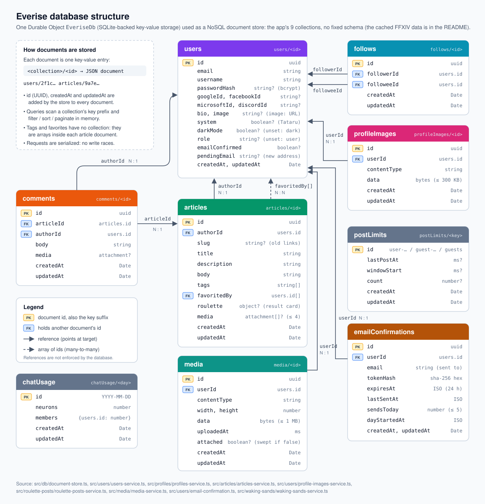

# Everise backend

A [TypeScript](https://www.typescriptlang.org/) backend for **Everise**, the Everise FC community site. It runs on [Cloudflare Workers](https://developers.cloudflare.com/workers/) with a [Durable Object](https://developers.cloudflare.com/durable-objects/) as its database, all on the free plan.

It covers users and authentication, profiles and follows, articles, comments, favorites, tags, feeds and pagination.

# How it works

The API is an [Express](https://expressjs.com/) app that runs inside a Cloudflare Worker through Cloudflare's [Node.js HTTP server support](https://developers.cloudflare.com/workers/runtime-apis/nodejs/http/). It serves a JSON REST API under `/api`.

Browsers don't call it directly: the [frontend](https://github.com/denis-coccodi/everise-frontend) Worker forwards its own `/api/*` to this Worker over a [service binding](https://developers.cloudflare.com/workers/runtime-apis/bindings/service-bindings/), so the site is a single origin (no CORS, first-party cookies). This Worker's own `workers.dev` address still works for local development, scripts and CI.

```
Browser ──> frontend Worker "prod" ──/api/*, service binding──> Worker "be-prod"
                                                                ├─ /assets/*  static files from public/
                                                                └─ /api/*     Express app ──RPC──> Durable Object "EveriseDb"
```

| Folder             | Contents                                                           |
| ------------------ | ------------------------------------------------------------------ |
| `src/worker.ts`    | Worker entry point: starts the Express app and exports `EveriseDb` |
| `src/app.ts`       | Express setup: CORS, JSON, cookies, routers, error handler         |
| `src/users`        | Registration, login, logout, current user, JWTs                    |
| `src/social-login` | Sign-in and sign-up with Google, Facebook, Microsoft and Discord   |
| `src/profiles`     | Profiles and follows                                               |
| `src/articles`     | Articles, comments, favorites, tags and feeds                      |
| `src/middleware`   | Authentication (`requireAuth` / `optionalAuth`)                    |
| `src/db`           | The document store and the `EveriseDb` Durable Object              |
| `__tests__`        | API tests, one file per endpoint                                   |
| `public`           | Static assets, e.g. the default avatar                             |

## Endpoints

Auth: **required** endpoints return 401 without a valid token, and **admin** ones also 403 for anyone who isn't an admin; **optional** ones add viewer-specific fields such as `following` and `favorited` when a token is sent.

| Method | Path                                    | Auth     | Description                                                                                                 |
| ------ | --------------------------------------- | -------- | ----------------------------------------------------------------------------------------------------------- |
| POST   | `/api/users`                            |          | Register                                                                                                    |
| POST   | `/api/users/login`                      |          | Log in                                                                                                      |
| POST   | `/api/users/logout`                     |          | Clear the auth cookie                                                                                       |
| GET    | `/api/auth/providers`                   |          | The sign-in providers set up: `{providers: ["google", "facebook"]}`                                         |
| GET    | `/api/auth/:provider`                   |          | Start signing in with `google` or `facebook` (a browser redirect)                                           |
| GET    | `/api/auth/:provider/callback`          |          | The provider's redirect back; signs in and redirects to the site                                            |
| GET    | `/api/discord/widget`                   |          | Who's online on the Discord server: `{widget}`, null when its widget is off ([Discord](#discord))           |
| GET    | `/api/user`                             | required | Current user                                                                                                |
| PUT    | `/api/user`                             | required | Update the current user                                                                                     |
| PUT    | `/api/user/image`                       | required | Upload a profile picture ([Profile pictures](#profile-pictures))                                            |
| DELETE | `/api/user/image`                       | required | Remove the profile picture                                                                                  |
| GET    | `/api/profile-images/:id`               |          | An uploaded profile picture                                                                                 |
| POST   | `/api/media`                            | required | Upload an image or GIF for a post or comment (the file as the body) ([Media](#media-in-posts-and-comments)) |
| GET    | `/api/media/:id`                        |          | An uploaded image or GIF                                                                                    |
| GET    | `/api/gifs/available`                   |          | Whether the GIF search is set up: `{available}`                                                             |
| GET    | `/api/gifs`                             | required | A page of GIFs from GIPHY (`q`, `offset`): `{gifs, next}`                                                   |
| GET    | `/api/live` (WebSocket)                 |          | Live updates: new posts ([Live updates](#live-updates))                                                     |
| POST   | `/api/roulette-results`                 | optional | Post an accepted roulette result to the feeds ([Roulette results](#roulette-results))                       |
| GET    | `/api/profiles/:id`                     | optional | Get a profile                                                                                               |
| POST   | `/api/profiles/:id/follow`              | required | Follow a user                                                                                               |
| DELETE | `/api/profiles/:id/follow`              | required | Unfollow a user                                                                                             |
| GET    | `/api/articles`                         | optional | List articles (`tag`, `author`, `favorited`, `limit`, `offset`)                                             |
| GET    | `/api/articles/feed`                    | required | Articles by followed users (`limit`, `offset`)                                                              |
| POST   | `/api/articles`                         | required | Create an article                                                                                           |
| GET    | `/api/articles/:id`                     | optional | Get an article                                                                                              |
| PUT    | `/api/articles/:id`                     | required | Update your article                                                                                         |
| DELETE | `/api/articles/:id`                     | required | Delete your article                                                                                         |
| POST   | `/api/articles/:id/favorite`            | required | Favorite an article                                                                                         |
| DELETE | `/api/articles/:id/favorite`            | required | Unfavorite an article                                                                                       |
| GET    | `/api/articles/:id/comments`            | optional | List comments                                                                                               |
| POST   | `/api/articles/:id/comments`            | required | Add a comment                                                                                               |
| DELETE | `/api/articles/:id/comments/:commentId` | required | Delete your comment                                                                                         |
| GET    | `/api/tags`                             |          | List tags                                                                                                   |
| GET    | `/api/admin/users`                      | admin    | Members with their roles, a page at a time (`search`, `limit`, `offset`) ([Roles](#roles-and-admin))        |
| PUT    | `/api/admin/users/:id/role`             | admin    | Make a member a `staging-tester` or a `user`; syncs staging access                                          |
| DELETE | `/api/admin/users/:id`                  | admin    | Delete a member and everything they posted, for good                                                        |
| POST   | `/api/admin/staging-access`             | admin    | Write the staging testers to Cloudflare Access again                                                        |
| GET    | `/api/admin/tataru`                     | admin    | Tataru's profile                                                                                            |
| PUT    | `/api/admin/tataru`                     | admin    | Edit Tataru's bio                                                                                           |
| PUT    | `/api/admin/tataru/image`               | admin    | Upload Tataru's picture                                                                                     |
| GET    | `/api/duties`                           |          | FFXIV duties, grouped by type ([FFXIV duties](#ffxiv-duties))                                               |
| GET    | `/api/roulettes`                        |          | FFXIV duty roulettes                                                                                        |
| GET    | `/api/frontline`                        |          | Today's Frontline map and the next days' maps                                                               |
| GET    | `/api/jobs`                             |          | FFXIV combat jobs, with role and icon                                                                       |
| GET    | `/api/images/:id`                       |          | A game image the data refers to (icons, banners)                                                            |
| POST   | `/api/duties/refresh`                   | key      | Re-download the game data from XIVAPI (`X-Refresh-Key` header)                                              |
| POST   | `/api/duties/refresh/images`            | key      | Download the next batch of game images                                                                      |

## Ids in links

Posts and members are identified by their ids (the database's UUIDs) everywhere: in the API's paths (`/api/articles/:id`, `/api/profiles/:id`, `/api/admin/users/:id`), in the `author` and `favorited` filters of `GET /api/articles`, and in every answer (`article.id`, `author.id`, `profile.id`, `user.id`, and comments' `id`). A title or a username can change; an id can't, so links keep working. Titles may repeat.

Links from before still work: a post is also found by the slug its old links used (made from its title, kept only on posts from then), and a member by their username.

## Profile pictures

People upload a profile picture instead of typing a URL.

- **`PUT /api/user/image`** takes the file itself as the request body (any content type) and returns the updated user, whose `image` is the picture's URL, `<BASE_URL>/api/profile-images/<id>`. The previous upload is deleted.
- **Limits:** at most **300 KB** and **500 × 500 pixels** (pictures are kept as uploaded and shown at most about 100 px wide), PNG, JPEG, WebP or GIF. The format and size are read from the file's bytes, never from the client's content type, so nothing else (an SVG, a script) is ever stored or served. Breaking a limit returns 413 (size) or 422 (pixels, format) with a message saying what to change.
- **`DELETE /api/user/image`** goes back to the default picture and deletes the upload.
- **`GET /api/profile-images/:id`** serves a picture with its detected type, `X-Content-Type-Options: nosniff` and a sandboxing `Content-Security-Policy`. Each upload gets a new id, so it is cached for a year.
- `PUT /api/user` still accepts an `image` URL, as the RealWorld API defines.

## Media in posts and comments

**Attachments.** A post has up to 4 images, GIFs and YouTube videos (`media` in `POST` and `PUT /api/articles`), a comment one (`media` in `POST /api/articles/:id/comments`, a list of at most one), kept apart from the text and shown in a grid in the feeds. Each is `{kind: "image" | "gif" | "video", url, alt?, width?, height?}`; the backend checks them (`src/media/attachments.ts`): images need an https address (or are this site's uploads), a video must be a YouTube link and is stored as `{kind: "video", url (a plain watch link), videoId, start?}`. A post or comment with media may have no text. Answers carry `article.media` (a list) and `comment.media` (or null).

**Uploads and attachments.** An upload starts unattached; a post or comment that uses it claims it. Deleting the post or comment, or removing the attachment in an edit, deletes the uploads it used (only its author's: someone else's upload is never deleted), and deleting a post deletes its comments too. An upload never attached is deleted a day later, the next time its owner uploads. Uploads from before attachments are never swept, because old posts use them from their text.

**Posts from before attachments** had their media in the text: Markdown images and YouTube links alone on a line. They're read as attachments, with the text without them, so they show like new posts; the stored post only changes when it's next saved with `media`.

Posts and comments are Markdown, so images go in as `` and a YouTube link on a line of its own shows as a video preview (the site does that). The backend stores uploads and searches GIFs (`src/media`):

- **Uploads** (`POST /api/media`, the file as the body): PNG, JPEG, WebP or GIF, read from the file's bytes, up to **1 MB** and 4096 × 4096 pixels (the site shrinks larger pictures before uploading; a GIF keeps its animation, so it must already fit), and **30 a day** per person (429 with `Retry-After` after that). Each upload is one `media` document holding its bytes. The answer is `{"media": {id, url, contentType, width, height}}`; `GET /api/media/:id` serves it with the same headers as profile pictures (cached for good, `nosniff`, sandboxed). Deleting a member deletes their uploads.
- **GIF search** (`GET /api/gifs?q=…&offset=…`, signed in): GIPHY's search, or trending GIFs without `q`, rated PG-13 at most, 24 a page. The backend calls GIPHY with `GIPHY_API_KEY` so the key stays secret, and answers `{"gifs": [{id, title, previewUrl, url, width, height}], "next": <offset or null>}`; `url` is GIPHY's "downsized medium" rendition. Without the key, `GET /api/gifs/available` says `false` and the site hides the search.

## Discord

- **Announcements:** every new post and roulette result is announced in a Discord channel through its webhook (`DISCORD_WEBHOOK_URL`, `src/discord/discord-announcer.ts`): a card with the title, description, author, a link back, and the duty, details and party for a roulette result, with the duty's banner (or the post's first image). A post's first YouTube video (a link alone on its line, as the site shows them) follows the card as a message of its own: Discord only previews links, and plays videos, in a message without a card of its own. Messages are sent with `?wait=true`, so they arrive in order. It never pings anyone (`allowed_mentions` is empty). A slow or failing Discord can't hold up or fail the post: it waits 3 seconds at most and only logs a failure. It rides on the same feed as the live updates, so it covers everything that creates a post.
- **Widget:** `GET /api/discord/widget` reads the server's public widget (`DISCORD_GUILD_ID`, in `wrangler.jsonc`), at most once a minute, and answers `{"widget": {name, presenceCount, members: [{name, avatarUrl, status}]}}` with up to 12 members, or `{"widget": null}` when the server's widget is turned off.

## Live updates

`GET /api/live` with a WebSocket upgrade subscribes to live updates. The backend isn't a plain Node server but Express inside a Cloudflare Worker, which can't hold connections open, so the sockets live in a separate Durable Object, `LiveHub` (`src/live/live-hub.ts`), using Cloudflare's **WebSocket Hibernation API**: the object sleeps between events with the sockets kept open, so idle connections cost nothing.

- **Events** are JSON, one per message. So far one kind: `{"type": "article-created", "article": {…}}`, pushed when any article is created (roulette results included), with the article exactly as `GET /api/articles` returns it to someone who isn't signed in (`favorited` and `author.following` are false): nothing personal is broadcast, and pages insert it into their lists as it is. Publishing is best effort: a post is saved even when the hub is unreachable.
- **Heartbeat:** a client sends `ping` every 25 seconds and gets `pong`, answered by the runtime without waking the hub. It only keeps the connection open: Cloudflare closes WebSockets that stay silent for about 100 seconds. Clients only listen; anything else they send is ignored.
- **Origins:** browsers send the page's `Origin` with a WebSocket and no CORS check applies, so only `BASE_URL`'s origin and `CORS_ORIGINS` may connect (403 otherwise).
- **Routing:** `src/worker.ts` sends WebSocket requests for `/api/live` to the hub before Express sees them; through the frontend Worker's service binding, browsers connect same-origin (`wss://<site>/api/live`).
- **Config:** the `LIVE` Durable Object binding, in both environments, and the `v2` migration that adds the `LiveHub` class.

## Roles and admin

Every user has a `role`, returned with the user (sign-up, sign-in, `GET` and `PUT /api/user`):

- **`user`**: everyone who registers.
- **`staging-tester`**: given by an admin; may open the staging site to test it.
- **`admin`**: whoever's email is in the `ADMIN_EMAILS` secret. It's never stored, so it can't be given or taken away through the API (changing an admin's role is refused with 422).

Admins can (all under `/api/admin`, 403 for everyone else):

- **List the members** (`GET /api/admin/users`: username, email, picture, role; system accounts left out; `search` keeps those whose username or email contains it, in any case; `limit` (1–100, default 20) and `offset` page through them; `usersCount` is how many match, and `stagingAccessConnected` says whether role changes reach Cloudflare Access) and **change a role** (`PUT /api/admin/users/:id/role` `{"role": "staging-tester" | "user"}`).
- **Delete a member** (`DELETE /api/admin/users/:id`), for good, as the privacy policy promises when someone asks: their account, posts (with every comment on them), comments elsewhere, favourites, follows both ways, uploaded pictures and roulette posting limit, in one batch write to the database (`src/admin/member-deletion.ts`). Their sessions stop working, since the account is gone. A deleted staging tester's staging access is synced away (`stagingAccess` in the answer). Admins (remove them from `ADMIN_EMAILS` first, 422) and system accounts such as Tataru (404) can't be deleted. The answer: `{"deleted": {"username", "articles", "comments"}}`, the counts being their own posts and comments.
- **Edit Tataru** ([below](#roulette-results)): her bio (`PUT /api/admin/tataru` `{"tataru": {"bio": "…"}}`) and her picture (`PUT /api/admin/tataru/image`, the file as the body, with the same checks as anyone's upload).

**Staging access.** Staging is behind Cloudflare Access. Both staging applications use one reusable Allow policy of staging testers, and the backend keeps that policy in step with the roles: after every role change it writes the admins' and staging testers' emails into the policy's Include (`src/admin/staging-access.ts`, through the Cloudflare API), and `POST /api/admin/staging-access` writes them again, e.g. after setting it up or after a failed attempt. The role is saved even if Cloudflare can't be reached; the answer's `stagingAccess` (`{synced, message}`) says what happened. A tester then opens staging and signs in to Access with the one-time code sent to the email of their Everise account.

Only the **production** backend has the Cloudflare settings (`CF_ACCESS_API_TOKEN`, `CF_ACCOUNT_ID`, `CF_ACCESS_POLICY_ID`): production holds the real members, and a second backend writing its own testers into the same policy would undo the first. Without them the roles still work, and the answer says which settings are missing ("Staging access isn't connected on this backend (missing CF_ACCESS_API_TOKEN, …)"). On staging that message is expected: manage roles from production. Setting it up: [One-time setup](#one-time-setup).

## Dark mode

The user returned by sign-up, sign-in, `GET /api/user` and `PUT /api/user` has a `darkMode` flag: the site's colour mode, saved with the other settings so it follows the person to every browser. It's `true` until they turn it off with `PUT /api/user` `{"user": {"darkMode": false}}`; other updates leave it as it is.

## Roulette results

An accepted roulette result is posted to the feeds as an article tagged `roulette`, with a `roulette` card (`type`, `name`, `detail`, `mode`, `dutyUnknown`, `image`, `job`, `guest`) that the frontend shows like the roulette's "Duty Found" window. Other articles don't have the field.

- **`POST /api/roulette-results`** takes `{result: {type, candidate: {kind, id}, mode, jobId?}, comment?}`: only what the reels landed on, as ids. The backend checks it's a result the roulette can produce (the duty belongs to that type, the party settings are possible for it, dealer's choice deals a job that can queue) against its cached duty data, and builds the card itself. Anything else is refused with 422 and a message.
- **Signed in**, the result is posted as the user, with their optional comment (up to 280 characters) as the body.
- **Not signed in**, it's posted by **Tataru**, a real account that nobody can sign in to (`system: true`, a random password that's never kept; the username is reserved), with one of her lines about catching a guest sneaking a spin. Guests can't add text. Only admins edit her bio and picture ([Roles and admin](#roles-and-admin)). Her picture is stored and served like anyone's upload (`/api/profile-images/<id>`): when she's first needed, the bundled `public/assets/images/tataru.png` (the "dress-up Tataru" minion portrait from the game's data, via XIVAPI, used under Square Enix's fan site materials licence like the other game images) is stored as her upload, read through the Worker's `ASSETS` binding. An account that still points at the old `/assets/images/tataru.png` address is moved the same way.
- **Limits:** one result every 15 seconds per user, one a minute per guest address (`CF-Connecting-IP`, stored hashed), and 60 guest results an hour in all. Over a limit: 429 with `Retry-After` and a message.
- `POST /api/articles` still needs a signed-in user: this endpoint can only ever post a real result card.

## Error messages

Errors keep the RealWorld shape, `{"errors": {"body": ["…"]}}`. The sign-up, sign-in and settings endpoints return messages written for the person filling in the form (`src/users/user-fields.ts`), all of them at once: "Enter a valid email address, like name@example.com.", "That username is taken. Try another one.", "Wrong email or password." (which never says whether the email exists).

## FFXIV duties

The backend keeps a copy of Final Fantasy XIV game data, read from [XIVAPI](https://v2.xivapi.com/api/docs), which serves the game's own data sheets: every duty and duty roulette (`ContentFinderCondition`, `ContentRoulette`), the combat jobs (`ClassJob`), and the images they refer to.

- **`GET /api/duties`** returns `{dataVersion, fetchedAt, groups}`. Each group (Dungeons, Trials — Extreme, Raids — Savage, Alliance Raids, Deep Dungeons, …) lists its duties with level and item level requirements, expansion, `finder` (`Duty Finder`, `Raid Finder`, or `""` for neither), the Duty Finder settings it allows (`joinPartyInProgress`, `unrestrictedParty`, `minimumIL`, `explorerMode`, `dutyRecorder`) and the roulettes it belongs to. PvP duties have a `pvpType` (`Frontline`, `Rival Wings` or `Crystalline Conflict`; `""` for other duties), and `activeFrontline` is `true` for the one Frontline map in today's daily challenge.
- **`GET /api/roulettes`** returns `{dataVersion, fetchedAt, icon, roulettes}`; `icon` is the Duty Roulettes type's icon.
- **`GET /api/jobs`** returns `{dataVersion, fetchedAt, jobs}`: the Disciple of War and Magic jobs in the game's order (tanks, healers, melee, ranged), each with `name`, `abbreviation`, `role` (`Tank`, `Healer`, `Melee DPS`, `Physical Ranged DPS` or `Magical Ranged DPS`), `startingLevel`, `limited` (`true` for Blue Mage and Beastmaster, which can't queue for regular duties) and `icon`. Classes, crafters and gatherers are left out.
- **Images.** Duty groups have an `icon` (the duty type's), duties and roulettes an `image` (the game's banner), and jobs an `icon` (the framed, role-coloured one). Each is an image id, or `null` without one; **`GET /api/images/:id`** serves it (PNG for icons, JPEG for banners), cached by browsers for a week. Ids are the game's own icon ids.
- **`GET /api/frontline`** returns `{active, schedule}`: today's Frontline map and the full 8-day cycle from today, each as `{map, dutyId, from, until}`. `dutyId` links to the duty in `/api/duties` (null before the first refresh).
- **`POST /api/duties/refresh`** downloads the duties, roulettes and jobs again and replaces the cached copies. It needs the `DUTIES_REFRESH_KEY` secret in an `X-Refresh-Key` header, and is disabled when the secret is unset. A failed download returns 502 and leaves the cached data unchanged. Its response's `images` (`{total, pending, failed}`) starts the image downloads.
- **`POST /api/duties/refresh/images`** (same key) downloads the next 25 images; call it until `pending` is 0. A Worker on the free plan may make only 50 outbound requests per call, so the roughly 530 images take about 22 calls. Every refresh downloads all of them again; until a batch replaces an image, the old copy is still served, and after the last batch images the new data no longer refers to are deleted. Images XIVAPI doesn't have are listed in `failed`; a batch that fails on an XIVAPI error returns 502 and stays pending for the next call.

Run both after a game patch, through the **Refresh FFXIV duties** workflow ([CI/CD](#cicd)), which makes all the calls. Before the first refresh the lists are empty, with `fetchedAt: null`.

Some of the game's flags are unreliable, so the grouping relies on duty names and types: Extreme, Unreal and Savage are recognised by their names, alliance raids by their 24-player party size, and quest battles, tutorials and other non-duties are left out. A duty anyone can enter at level 1 but that syncs to a level (treasure dungeons) takes the sync level as its `level`, and duties outside the Duty Finder and Raid Finder report no Duty Finder settings (the game marks them anyway). `src/duties/xivapi-client.ts` has the rules.

The Frontline daily map isn't in the game data, so it is computed without any API call from a fixed rotation in `src/duties/frontline-rotation.ts`. The map changes at the daily reset, 15:00 UTC, through an 8-day cycle taken from the [community wiki](https://ffxiv.consolegameswiki.com/wiki/Template:Current_Frontline_map). When a patch changes the rotation, update the list and its start date there; the tests check it against the wiki's formula.

## Database



The database is a single instance, named `everise`, of the `EveriseDb` Durable Object class, with SQLite-backed storage. The app uses it as a small NoSQL document store (`src/db`):

- **Documents and keys.** Every document is a JSON value stored under the key `<collection>/<id>`, e.g. `users/2f1c…`. The app's collections are `users`, `follows`, `articles`, `comments`, `profileImages` (uploaded pictures, one document each with the bytes and the owner's `userId`), `media` (images and GIFs uploaded for posts and comments, one document each with the bytes and the uploader's `userId`) and `postLimits` (when each person last posted a roulette result, and the guests' hourly count). The cached FFXIV data adds `dutyGroups` (one document per duty group), `dutyRoulettes`, `jobs` and `dutyRefreshes` (one document each), which every refresh replaces, and `gameImages` (one document per image, its id the game's icon id, holding the bytes) with `gameImageDownloads` (the refresh's pending downloads and an index of the stored images).
- **Common fields.** The store gives every new document an `id` (a UUID, or the id passed to `set`, which creates or replaces a document under a chosen id), `createdAt` and `updatedAt`. An update that changes nothing keeps the old `updatedAt`.
- **References.** Documents point to each other by id (`authorId`, `articleId`, `followerId`, `followeeId`). The database does not enforce these links; the services check them.
- **Arrays instead of collections.** An article's tags live in its `tags` array and the users who favorited it in its `favoritedBy` array, so there is no tags or favorites collection.
- **Queries.** `find` lists a collection by key prefix, then filters (`==` or `array-contains`), sorts and paginates in memory. This is fine at this app's scale but would need indexes for large data.
- **Consistency.** The Durable Object handles one request at a time and its storage is strongly consistent, so checks like "is this username taken?" can't race.
- **Access.** The Worker reaches the Durable Object over RPC through `DurableObjectDb`, which implements the same `Db` interface as the store. Tests use the same `DocumentStore` on an in-memory storage, so they exercise the real query logic.

Data is stored durably by Cloudflare. Locally it lives in `.wrangler/state`.

The instance name selects the storage: a different name is a different, empty database. Every deploy counts articles before and after and fails if any were lost.

## Authentication

Registering or logging in returns a JWT in the response body and also sets it in an `httpOnly`, `Secure` cookie named `token`. Protected endpoints accept either that cookie or an `Authorization: Token <jwt>` (or `Bearer <jwt>`) header. `POST /api/users/logout` clears the cookie.

### Google, Facebook, Microsoft and Discord

One button per provider both signs in and signs up (`src/social-login`), with the standard OAuth authorization code flow run entirely by the backend, so the site loads none of the providers' scripts:

1. The site links to `GET /api/auth/<provider>` (`google`, `facebook`, `microsoft` or `discord`). The backend sets a short-lived `social_login` cookie holding a random state and redirects to the provider's sign-in page.
1. The provider sends the browser back to `BASE_URL/api/auth/<provider>/callback` with a one-time code and the state. A state that doesn't match the browser's cookie is refused, so nobody can slip their own account into someone else's browser.
1. The backend trades the code for the person's profile, server to server with the app's secret, and picks the account: the one already tied to that provider account (`googleId`, `facebookId`, `microsoftId` or `discordId` on the user), else the one with the same email, which is then tied to it, else a new one. A new account's username is the person's name without spaces or symbols, with a number added when taken; it has no password until one is set in Settings.
1. It sets the usual `token` cookie and redirects to the site, which loads the user as on any visit. Problems redirect to `/login?social=<problem>` (`cancelled`, `expired`, `no-email`, `failed`, `unavailable`), which the sign-in page explains.

The user (sign-in, sign-up, `GET` and `PUT /api/user`) carries `signInMethods`, e.g. `["password", "google"]`: how the account can be signed in to, which the site's settings show.

Only confirmed email addresses are used: Google's `email_verified`, Discord's `verified`, and Facebook only shares confirmed ones (a Facebook account made with a phone number has none and can't sign in). Microsoft sign-in is limited to personal Microsoft accounts (Outlook, Hotmail, Xbox; the `consumers` endpoints), whose email is the address they sign in with: work and school accounts are left out, because their organisations can set an email address nobody confirmed. Tying by email trusts that whoever registered an Everise account with a password owns that address; registration doesn't confirm addresses, so someone could register a victim's address first and keep a password to the account the victim later reaches through a provider. Confirming emails at registration would close that.

The cookie's `SameSite` value comes from `COOKIE_SAME_SITE`:

- `none` (default): needed while the frontend runs on another site, e.g. `localhost:4200` or another `*.workers.dev` subdomain. Every `*.workers.dev` subdomain counts as a separate site.
- `strict`: use this once the frontend and the API share one origin, for example a frontend Worker that forwards `/api/*` to this Worker through a [service binding](https://developers.cloudflare.com/workers/runtime-apis/bindings/service-bindings/).

# Getting started

1. Install [Node.js and npm](https://docs.npmjs.com/downloading-and-installing-node-js-and-npm).
1. Run `npm install`.
1. Create `.dev.vars` (used by `npm start`):
   ```
   BASE_URL=http://localhost:8080
   CORS_ORIGINS=http://localhost:4200,http://127.0.0.1:4200
   JWT_SECRET_KEY=dummy-jwt-secret-key
   ```
1. Run `npm start`. The API runs on http://localhost:8080 with a local Durable Object.

Local data survives restarts. Delete `.wrangler/state` to start from an empty database. Values in `.dev.vars` override the `vars` in `wrangler.jsonc`.

To check the API is up:

```
curl http://localhost:8080/api/tags
```

## Configuration

| Variable                    | Description                                                                                                                                                                                                                                                        |
| --------------------------- | ------------------------------------------------------------------------------------------------------------------------------------------------------------------------------------------------------------------------------------------------------------------ |
| `BASE_URL`                  | URL of the site users open (the frontend), used to build the default avatar URL; locally the API itself                                                                                                                                                            |
| `CORS_ORIGINS`              | Comma-separated frontend origins allowed to call the API with the user's cookie. Production lists only the deployed frontend; localhost is for local and staging use                                                                                               |
| `COOKIE_SAME_SITE`          | `none` (default), `lax` or `strict`                                                                                                                                                                                                                                |
| `JWT_SECRET_KEY`            | Secret used to sign JWTs. In production, set it as a Worker secret                                                                                                                                                                                                 |
| `JWT_ISSUER`                | JWT issuer                                                                                                                                                                                                                                                         |
| `JWT_SECONDS_TO_EXPIRATION` | JWT and cookie lifetime in seconds                                                                                                                                                                                                                                 |
| `DUTIES_REFRESH_KEY`        | Key that allows `POST /api/duties/refresh`; refreshing is disabled when unset. In production, set it as a Worker secret                                                                                                                                            |
| `ADMIN_EMAILS`              | Comma-separated emails of the admins ([Roles and admin](#roles-and-admin)). A Worker secret, so the addresses stay out of the repository; without it nobody is an admin                                                                                            |
| `CF_ACCESS_API_TOKEN`       | Production only: a Cloudflare API token with **Access: Apps and Policies → Edit**, to keep the staging testers' policy in step. A Worker secret                                                                                                                    |
| `CF_ACCOUNT_ID`             | Production only: the Cloudflare account of the Access policy                                                                                                                                                                                                       |
| `CF_ACCESS_POLICY_ID`       | Production only: the reusable Access policy that holds the staging testers' emails, by its **Policy ID** or its name as the dashboard shows it (e.g. `Staging Testers`; case, spaces and quotes don't matter). Its earlier name, `CF_ACCESS_GROUP_ID`, still works |
| `GOOGLE_CLIENT_ID`          | The Google sign-in app's client id ([One-time setup](#one-time-setup)); without it and the secret, the Google button isn't shown                                                                                                                                   |
| `GOOGLE_CLIENT_SECRET`      | The Google sign-in app's client secret. A Worker secret                                                                                                                                                                                                            |
| `FACEBOOK_APP_ID`           | The Facebook sign-in app's id; without it and the secret, the Facebook button isn't shown                                                                                                                                                                          |
| `FACEBOOK_APP_SECRET`       | The Facebook sign-in app's secret. A Worker secret                                                                                                                                                                                                                 |
| `MICROSOFT_CLIENT_ID`       | The Microsoft sign-in app's application (client) id; without it and the secret, the Microsoft button isn't shown                                                                                                                                                   |
| `MICROSOFT_CLIENT_SECRET`   | The Microsoft sign-in app's client secret value. A Worker secret; it expires (24 months at most), so renew it in time                                                                                                                                              |
| `DISCORD_CLIENT_ID`         | The Discord sign-in app's client id; without it and the secret, the Discord button isn't shown                                                                                                                                                                     |
| `DISCORD_CLIENT_SECRET`     | The Discord sign-in app's client secret. A Worker secret                                                                                                                                                                                                           |
| `GIPHY_API_KEY`             | GIPHY's API key for the GIF search in posts and comments ([One-time setup](#one-time-setup)); without it the search isn't offered. A Worker secret                                                                                                                 |
| `DISCORD_WEBHOOK_URL`       | Production only: the Discord channel's webhook address, where new posts are announced ([Discord](#discord)). A Worker secret; without it nothing is announced                                                                                                      |
| `DISCORD_GUILD_ID`          | The Discord server whose widget the home page shows; in `wrangler.jsonc`                                                                                                                                                                                           |

## Testing

1. Create `.env` (used by Jest):
   ```
   BASE_URL=http://localhost:8080
   CORS_ORIGINS=http://localhost:4200,http://127.0.0.1:4200
   JWT_SECRET_KEY=dummy-jwt-secret-key
   JWT_ISSUER=https://everisefc.com
   JWT_SECONDS_TO_EXPIRATION=86400
   ```
1. Run `npm test`.

The tests run the Express app in Node against an in-memory document store, so they need nothing else running. After the tests, `npm test` also type-checks and lints the code.

# Deployment

There are two environments, each a separate Worker with its own Durable Object, so their data never mixes:

| Environment | URL                                      | Deployed                                                        |
| ----------- | ---------------------------------------- | --------------------------------------------------------------- |
| staging     | https://be-staging.everisefc.workers.dev | automatically on every merge to `main`; by hand from any branch |
| production  | https://be-prod.everisefc.workers.dev    | by hand, once a commit has passed staging                       |

Both run on the Cloudflare free plan. Its daily limits (e.g. 100,000 Worker requests and 100,000 Durable Object requests) are shared by the whole account, so heavy traffic on staging uses up production's allowance too. Avoid load tests against staging.

## CI/CD

Three GitHub Actions workflows:

**CI/CD** (`.github/workflows/ci-cd.yaml`) runs on pushes to `main`, on pull requests, and by hand:

1. **test**: installs dependencies and runs `npm test` (tests, type-check and lint).
1. **deploy-staging**: after the tests pass, on pushes to `main` and on manual runs. Runs `wrangler deploy --env staging`, then `scripts/smoke.sh` against staging: it registers a user, creates an article and reads it back, and fails the run on any unexpected status code. On `main`, the run's summary page links to the production deploy.

Pull requests only run **test**, and it must pass before the PR can be merged. Each staging run leaves one smoke-test user and article in the staging database.

To try another branch on staging: Actions → **CI/CD** → **Run workflow**, pick the branch, and confirm. It runs the tests, then deploys that branch to staging. There is only one staging Worker, so it replaces whatever was there; the next merge to `main` puts `main` back.

**Deploy production** (`.github/workflows/deploy-production.yaml`) only runs when started by hand. It deploys the latest commit on `main` with `wrangler deploy` and checks the API responds. It refuses to deploy a commit whose CI/CD run (tests and staging) has not succeeded.

**Refresh FFXIV duties** (`.github/workflows/refresh-duties.yaml`) only runs when started by hand, and only for the repository owner (`denis-coccodi`). Actions → **Refresh FFXIV duties** → **Run workflow** → pick `staging` or `production` (production only from `main`). It calls `POST /api/duties/refresh` on that backend, then `POST /api/duties/refresh/images` until every image is downloaded (retrying a failed batch up to three times), and lists the new counts on the run's summary page. It deploys nothing.

### Contributing

`main` is protected: changes can't be pushed to it directly, admins included. Every change goes through a pull request:

1. Create a branch from `main` named `feature/<feature-name>`, e.g. `feature/staging-environment`.
1. Push to it as often as you like; pushing a feature branch deploys nothing.
1. Open a pull request to `main`. CI/CD runs **test** on it, and again on every push.
1. Merge once **test** passes (the branch must be up to date with `main`). The merge deploys to staging.

### Deploying to production

1. Merge a pull request into `main` and wait for the CI/CD run to go green.
1. Optionally try the change on staging.
1. Open Actions → **Deploy production** (or follow the link on the CI/CD run's summary page), click **Run workflow**, keep branch `main`, and confirm.

The `production` GitHub environment only accepts the `main` branch.

## Smoke test

`scripts/smoke.sh` can be run against any running instance:

```
sh scripts/smoke.sh create <base-url> /tmp/jar.txt   # register, create an article, read it back
sh scripts/smoke.sh verify <base-url> /tmp/jar.txt   # after a restart or redeploy: is the data still there?
```

Against staging, export `CF_ACCESS_CLIENT_ID` and `CF_ACCESS_CLIENT_SECRET` first (see [Staging access](#staging-access)).

## Staging access

Staging (backend `be-staging` and frontend `staging`) is restricted with [Cloudflare Access](https://developers.cloudflare.com/cloudflare-one/policies/access/) (Zero Trust Free plan): only allowed email addresses can open it, after logging in with a one-time code sent by email. Production is public.

- **Browser**: open https://be-staging.everisefc.workers.dev once and log in, then use the staging frontend (log in there too). Access's cookie lets the frontend's requests through.
- **CI**: the staging smoke test authenticates with an Access service token, stored as the `CF_ACCESS_CLIENT_ID` and `CF_ACCESS_CLIENT_SECRET` repository secrets.
- **Scripts**: export the same two variables before running `scripts/smoke.sh` against staging.

### Setting it up

In the Cloudflare dashboard (menu names may differ slightly):

1. **Service token for CI**: Zero Trust → Access controls → Service credentials → Service tokens → **Create service token**, e.g. `github-actions-staging`, no expiry or a long one. Copy the Client ID and Client Secret (the secret is shown once) and add them to this repository as the `CF_ACCESS_CLIENT_ID` and `CF_ACCESS_CLIENT_SECRET` secrets.
1. **Protect the backend**: Workers & Pages → `be-staging` → Domains → **Enable Access** on the workers.dev URL (and on Preview URLs). Then open the Access application it created (Zero Trust → Access controls → Applications) and set its policies:
   - Allow: Include → Emails → the allowed addresses.
   - Service Auth: Include → Service Token → `github-actions-staging`.
1. **Let the staging frontend call it**: in the same application's settings:
   - Cross-Origin Resource Sharing: allowed origin `https://staging.everisefc.workers.dev` (plus `http://localhost:4200` to use staging from a local frontend), allow credentials, and **bypass OPTIONS requests to origin** so the API answers preflight requests itself.
   - Cookie settings: SameSite attribute **None**.
1. **Protect the frontend**: `staging` → Domains → **Enable Access**, with the same Allow policy.
1. Re-run the latest CI/CD run on `main` and check the smoke test still passes.

Do steps 1 and 2's Service Auth policy before enabling Access on the backend, or the next staging smoke test fails.

## One-time setup

1. Create a free [Cloudflare account](https://dash.cloudflare.com/sign-up) and pick a `workers.dev` subdomain (Workers & Pages → Overview).
1. In `wrangler.jsonc`, set `BASE_URL` (top level and under `env.staging`) to your frontend Workers' URLs and add your frontend's origin to `CORS_ORIGINS`. Update the URLs in `.github/workflows/ci-cd.yaml` to match.
1. Set a JWT secret on each Worker, using a different long random string for each. They are kept across deploys:
   ```
   npx wrangler login
   npx wrangler secret put JWT_SECRET_KEY
   npx wrangler secret put JWT_SECRET_KEY --env staging
   ```
   One way to generate one: `node -e "console.log(require('crypto').randomBytes(48).toString('base64'))"`.
1. Create an [API token](https://dash.cloudflare.com/profile/api-tokens) from the **Edit Cloudflare Workers** template.
1. In the GitHub repository go to Settings → Secrets and variables → Actions and add these repository secrets:
   - `CLOUDFLARE_API_TOKEN`: the token from the previous step.
   - `CLOUDFLARE_ACCOUNT_ID`: shown in the Cloudflare dashboard (Workers & Pages → Overview).
1. Under Settings → Environments, create `staging` (any branch) and `production` (limited to the `main` branch).
1. **Admins:** set your email (comma-separated for several) on each Worker: `npx wrangler secret put ADMIN_EMAILS` and again with `--env staging`.
1. **Staging testers' access:**
   1. Zero Trust → Access controls → Policies → **Add a policy**, e.g. `Staging Testers`, action Allow, with Include → Emails → your own email for now.
   1. Use that policy in both staging Access applications (`staging` and `be-staging`), in place of their own email lists.
   1. My Profile → API Tokens → **Create token** → Custom token, permission **Account → Access: Apps and Policies → Edit**, for your account. Then on the production Worker only (`--name be-prod`, or from this folder with `--env=""`): `npx wrangler secret put CF_ACCESS_API_TOKEN`, `npx wrangler secret put CF_ACCOUNT_ID` and `npx wrangler secret put CF_ACCESS_POLICY_ID` (the policy's name, e.g. `Staging Testers`, or its **Policy ID** from Access controls → Policies). A sync replaces only the policy's Include with the emails; its name, action and other settings stay. If a sync fails, its message carries Cloudflare's reason, and when nothing matches it lists the policies the token can see.
   1. Once deployed, run "Sync staging access" in the site's admin settings (`POST /api/admin/staging-access`): the policy now lists the admins and staging testers.
1. **Sign-in with Google, Facebook, Microsoft and Discord** (per environment; the return address is the site's, `https://prod.everisefc.workers.dev` or `https://staging.everisefc.workers.dev`):
   1. **Google:** [Google Cloud console](https://console.cloud.google.com/) → APIs & Services → OAuth consent screen: set it up as External, with the app name and support email, and publish it. Then Credentials → **Create credentials** → OAuth client ID → Web application, with the authorised redirect URI `<site>/api/auth/google/callback`. Set the client id and secret on the Worker: `npx wrangler secret put GOOGLE_CLIENT_ID` and `npx wrangler secret put GOOGLE_CLIENT_SECRET` (add `--env staging` for staging).
   1. **Facebook:** [Meta for Developers](https://developers.facebook.com/apps/) → **Create app** → use case "Authenticate and request data from users with Facebook Login", and add the `email` permission. Under Facebook Login → Settings, add the valid OAuth redirect URI `<site>/api/auth/facebook/callback`. Under App settings → Basic, fill in the privacy policy URL and user data deletion instructions (required to go Live), then switch the app to Live. Set `FACEBOOK_APP_ID` and `FACEBOOK_APP_SECRET` the same way.
   1. **Microsoft:** [Azure portal](https://portal.azure.com/) → Microsoft Entra ID → App registrations → **New registration**, supported account types "Personal Microsoft accounts only", redirect URI (Web) `<site>/api/auth/microsoft/callback`. Then Certificates & secrets → **New client secret** and copy its **Value**. Set `MICROSOFT_CLIENT_ID` (the Application (client) ID on the Overview page) and `MICROSOFT_CLIENT_SECRET`. The secret expires; add a new one before it does.
   1. **Discord:** [Discord Developer Portal](https://discord.com/developers/applications) → **New Application** → OAuth2: copy the Client ID, **Reset Secret** for the Client Secret, and add the redirect `<site>/api/auth/discord/callback`. Set `DISCORD_CLIENT_ID` and `DISCORD_CLIENT_SECRET`.
   1. One app per provider can serve both environments: list both redirect URIs.
1. **GIF search:** [GIPHY for Developers](https://developers.giphy.com/dashboard/) → **Create an App** → **API** (not SDK), name it and describe it, and copy its API key. Set it on each Worker: `npx wrangler secret put GIPHY_API_KEY` (and `--env staging`). A new key is a beta key, limited to 100 searches an hour; request a production key from the app's page once the site uses it (GIPHY reviews it, and wants its "Powered by GIPHY" mark shown, which the site's GIF picker does).
1. **Discord:**
   1. **Announcements:** in the channel's settings → Integrations → Webhooks → **New Webhook**, name it `Everise`, then **Copy Webhook URL** and set it on production only: `npx wrangler secret put DISCORD_WEBHOOK_URL --name be-prod` (staging's test posts would otherwise appear too).
   1. **Widget:** Server Settings → Engagement → **Server Widget** → turn on **Enable Server Widget**, and pick an invite channel. The server id is already in `wrangler.jsonc` (`DISCORD_GUILD_ID`).
1. For the duty refresh, pick a long random key per environment and set it twice: as the Worker secret (`npx wrangler secret put DUTIES_REFRESH_KEY`, and again with `--env staging`) and as a `DUTIES_REFRESH_KEY` secret in the matching GitHub environment (Settings → Environments → `production` / `staging` → Add environment secret).

To deploy from your machine instead, run `npx wrangler deploy --env staging` or `npm run deploy` (production) after `npx wrangler login`.
